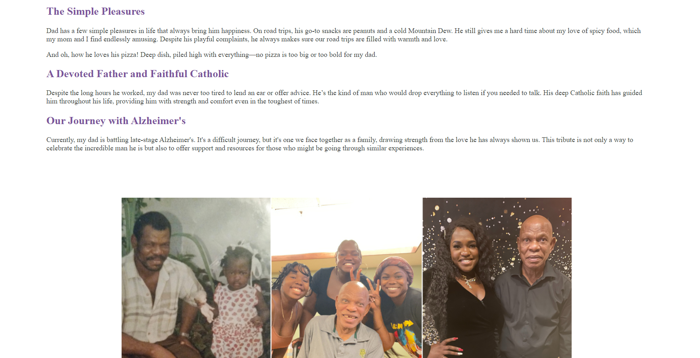

# Tribute Page

## Table of contents

- [Overview](#overview)
  - [The challenge](#the-challenge)
  - [Screenshot](#screenshot)
  - [Links](#links)
- [My process](#my-process)
  - [Built with](#built-with)
  - [What I learned](#what-i-learned)
  - [Continued development](#continued-development)
  - [Useful resources](#useful-resources)

## Overview

This project is a tribute page dedicated to Petuel Jean-Francois, created as part of a FreeCodeCamp project. The page celebrates the life and legacy of my father while also raising awareness about Alzheimer's disease.

### The challenge

The challenge involves creating a tribute page with a main element containing all content. Within this, there must be a non-empty title element. A figure or div with id="img-div" should include an img element with id="image" and a figcaption or div with id="img-caption", with the caption not being empty. Additionally, the page should feature a tribute-info section with content and an a element with id="tribute-link" that includes an href and target="\_blank". The image should be responsive with display: block, max-width: 100%, and height: auto, and it should be centered within its container.

### Screenshot

### Links

- Solution URL: [https://github.com/Jud1th1/tribute-page/](https://github.com/Jud1th1/tribute-page/)
- Live Site URL: [https://tribute-page-pjfran.app/](https://tribute-page-pjfran.netlify.app/)

## My process

1. **Conceptualization**: I began by defining the core concept of the tribute page, focusing on celebrating the life and legacy of my father, Petuel Jean-Francois. The aim was to create a heartfelt and respectful tribute while also providing useful information about Alzheimer’s disease. I sketched out a layout that would feature personal anecdotes, images, and educational content in a clear and engaging manner.

2. **Design and Styling**: I designed a clean and visually appealing layout that reflects the warmth and dignity of the tribute. I chose a color palette with deep purples and soft grays to convey a sense of calm and respect. The responsive design ensures that the page looks good on both desktop and mobile devices. The use of custom fonts and a well-structured layout helped create an inviting and easy-to-navigate page.

3. **Frontend Development**: I implemented the page using HTML and CSS. The HTML structure includes key elements like a main container, title section, image section, and detailed tribute information. I used CSS to style these elements, ensuring the image is responsive and centered, and that the text sections are clearly defined and visually appealing. Media queries were used to optimize the layout for different screen sizes, and the page includes an external link to additional resources about Alzheimer’s disease.

### Built with

- HTML
- CSS

### What I learned

This project served as a valuable refresher after a long break from coding. It helped me revisit and strengthen core HTML and CSS skills, focusing on creating a responsive and visually appealing layout. This project reinforced the importance of patience and attention to detail in coding.
